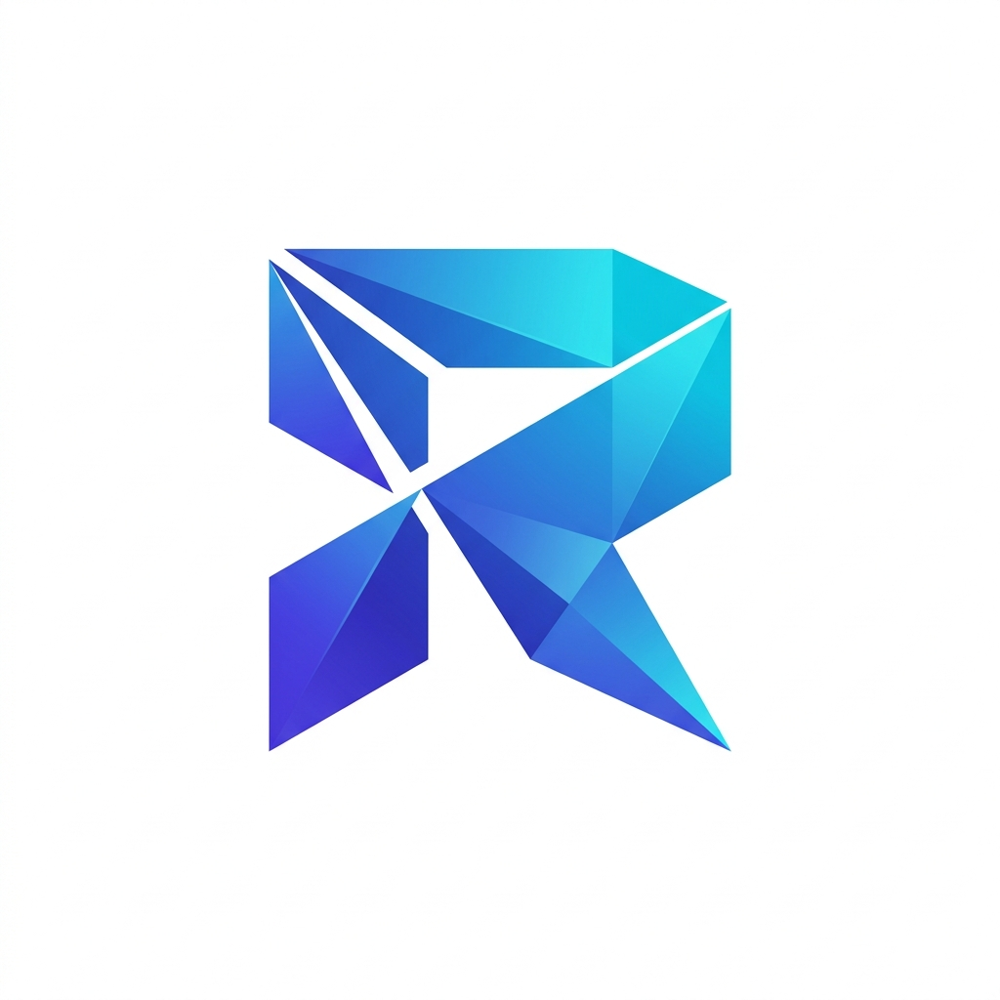
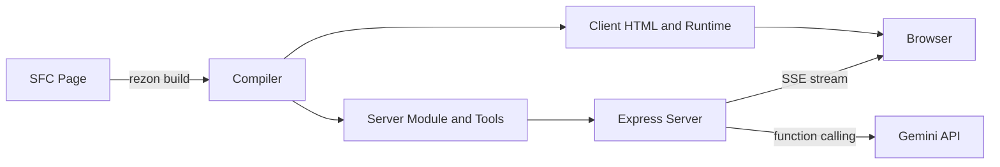
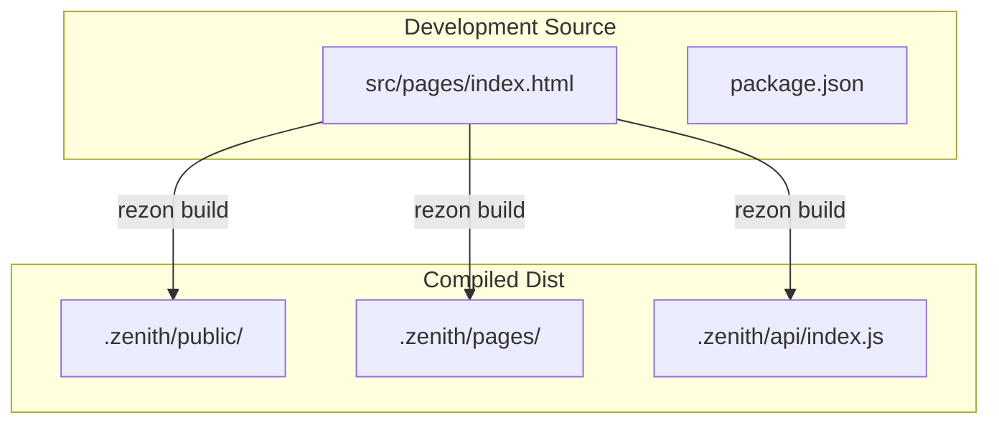
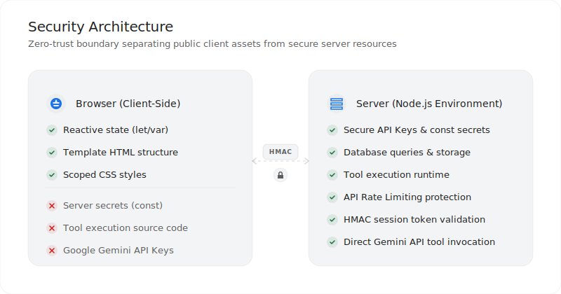
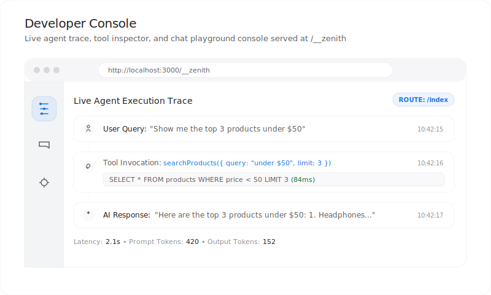

<p align="center">
  
</p>

<p align="center">
  <strong>Build AI-native apps. Ship faster.</strong>
</p>

<p align="center">
  <a href="https://www.npmjs.com/package/rezon"></a>
  <a href="https://www.npmjs.com/package/rezon"></a>
  <a href="#"></a>
  <a href="LICENSE"></a>
</p>

<br/>

## What is Rezon?

Rezon is a **compiler-based, AI-first web framework** that lets you build full-stack agent-native applications in a single file. Declare your UI, state, and server-side AI tools together — the compiler handles the rest.

### Key Features

| Frontend (Reactive UI) | Backend (Server Tools & Agents) | Developer Experience (DX) |
| :--- | :--- | :--- |
| **⚡ Reactive UI Components**<br/>Direct bindings (`z-bind`) & loops (`z-each`) | **🔒 Server-Side Node.js Tools**<br/>Secure server tools declared inline | **📊 Dev Dashboard**<br/>Real-time trace viewer & tool inspector |
| **🔄 SSE Streaming**<br/>Smooth, real-time response streams | **🧬 Gemini API Integration**<br/>Auto model setup & tool-calling | **🚀 Vercel Serverless Ready**<br/>Compiles to serverless entrypoints |

<br/>

## ⚡ Quick Start

```bash
npx rezon init my-app
cd my-app
npm install
```

Set your GEMINI_API_KEY in the `.env` file at the root of your project:

```env
GEMINI_API_KEY=your_key_here
```

Then run the development server:

```bash
npm run dev
```

Open **http://localhost:3000** — your AI app is live. 🚀

The `init` command scaffolds everything for you — `package.json`, `.gitignore`, `.env.example`, and a polished starter page with a chat UI and a sample server tool.

Want to customize? Edit `src/pages/index.html` — the dev server hot-reloads on save.

<br/>

## 🧬 How It Works



Rezon's compiler splits your Single File Component into:

| Output | Contains | Runs On |
|--------|----------|---------|
| **Client HTML** | Template, styles, reactive bindings | Browser |
| **Server Module** | Tool functions, agent config | Node.js |
| **Dev Dashboard** | Trace viewer, tool inspector | Browser |

<br/>

## 📐 Architecture



<br/>

## 🛠️ Component Syntax

### State Variables

```javascript
// ✅ Client-side reactive state (shipped to browser)
let count = 0;
let messages = [];

// 🔒 Server-only constants (NEVER shipped to browser)
const API_SECRET = process.env.MY_SECRET;
```

### Server Tools

```javascript
/**
 * JSDoc becomes the tool description for the LLM
 * @param {string} query The search query
 * @param {number} limit Max results to return
 */
server tool searchProducts(query, limit) {
  // Full Node.js environment — databases, APIs, secrets
  const db = await connectDB();
  return db.products.search(query).limit(limit);
}
```

The compiler extracts this into a Gemini-compatible function declaration automatically:

```json
{
  "name": "searchProducts",
  "description": "JSDoc becomes the tool description for the LLM",
  "parameters": {
    "type": "object",
    "properties": {
      "query": { "type": "string", "description": "The search query" },
      "limit": { "type": "number", "description": "Max results to return" }
    },
    "required": ["query", "limit"]
  }
}
```

### Template Directives

| Directive | Example | Description |
|-----------|---------|-------------|
| `z-bind` | `<input z-bind="name" />` | Two-way data binding |
| `z-click` | `<button z-click="count++">` | Click handler |
| `z-each` | `<div z-each="item in list">` | Loop rendering |
| `z-if` | `<div z-if="show">` | Conditional rendering |
| `{var}` | `<span>{name}</span>` | Text interpolation |
| `agent.send()` | `agent.send(prompt)` | Send message to AI |

<br/>

## 🔒 Security

Rezon enforces a strict **zero-trust security boundary** between the browser and the Node.js server. Your codebase remains simple, but credentials and sensitive execution blocks never cross the network.

<p align="center">
  <picture>
    <source media="(prefers-color-scheme: dark)" srcset="./assets/security-dark.svg">
    <source media="(prefers-color-scheme: light)" srcset="./assets/security-light.svg">
    
  </picture>
</p>

#### 🔑 Key Security Pillars

*   **State Separation:** The compiler automatically ships reactive `let`/`var` variables to the client, but keeps all `const` declarations and server tools strictly server-side.
*   **Cryptographic Session Signing:** Client-server interactions are secured using HMAC-SHA256 tokens, preventing agent session hijacking.
*   **Production Lockdown:** The development dashboard is completely compiled out and disabled when running under `NODE_ENV=production`.
*   **Rate Limiting:** Built-in API protection via `express-rate-limit` prevents abuse.

<br/>

## 📊 Developer Dashboard

Rezon includes a built-in developer console served at `/__zenith` during local development. It is designed to inspect, debug, and play with your AI agents in real time.

<p align="center">
  <picture>
    <source media="(prefers-color-scheme: dark)" srcset="./assets/dashboard-dark.svg">
    <source media="(prefers-color-scheme: light)" srcset="./assets/dashboard-light.svg">
    
  </picture>
</p>

#### ⚡ Core Capabilities

*   **🔍 Live Execution Traces:** Follow the full lifecycle of every prompt, see the exact tool invocation parameters, view database execution metrics, and monitor API latency.
*   **💬 Interactive Chat Playground:** Test your agent's prompts and behaviors directly within the dashboard using a built-in messaging sandbox.
*   **📋 Tool Inspector:** View all compiler-registered tools, review description strings, and inspect the generated JSON schema definitions.
*   **🧬 Multi-Agent Support:** Quickly hot-swap and test different agent pages across your application routes.

<br/>

## 🚀 Deploy to Vercel

Rezon compiles to a Vercel-compatible serverless bundle:

```bash
# Build the production bundle
npm run build

# Deploy the compiled output
cd .zenith
npx vercel --prod
```

Set these environment variables in Vercel:

| Variable | Required | Description |
|----------|:--------:|-------------|
| `GEMINI_API_KEY` | ✅ | Google Gemini API key |
| `ZENITH_SESSION_SECRET` | ✅ | Random secret for session signing |
| `DATABASE_URL` | ⬚ | PostgreSQL URL (Neon, Supabase, etc.) |

> **Note:** Without `DATABASE_URL`, Rezon uses a local JSON file which won't persist on serverless. Use a managed PostgreSQL for production.

<br/>

## 🗄️ Database Support

| Mode | Config | Use Case |
|------|--------|----------|
| **JSON file** | Default (zero-config) | Local development |
| **PostgreSQL** | Set `DATABASE_URL` env var | Production / Vercel |

Supported PostgreSQL providers:
- [Neon](https://neon.tech) — 0.5 GB free tier
- [Supabase](https://supabase.com) — 500 MB free tier
- [Vercel Postgres](https://vercel.com/storage) — Native integration

<br/>

## 📦 Programmatic API

Use Rezon as a library in your own Express app:

```javascript
import { ZenithServer, tool } from 'rezon';

const server = new ZenithServer({
  port: 3000,
  apiKey: process.env.GEMINI_API_KEY,
  systemPrompt: "You are a helpful assistant.",
  tools: [
    tool({
      name: "calculate",
      description: "Evaluate a math expression",
      parameters: {
        type: "object",
        properties: {
          expression: { type: "string", description: "Math expression" }
        },
        required: ["expression"]
      },
      execute: ({ expression }) => ({ result: eval(expression) })
    })
  ]
});

server.start();
```

<br/>

## 🧪 Examples

Check the [`examples/`](examples/) directory for complete demo apps:

| Example | Description |
|---------|-------------|
| [`travel-planner/`](examples/travel-planner/) | AI travel guide with weather and attractions tools |
| [`wealth-advisor/`](examples/wealth-advisor/) | Financial AI with stock metrics, projections, and allocations |

<br/>

## 🤝 Contributing

Contributions are welcome! Please feel free to submit a Pull Request.

<br/>

## 📄 License

MIT © Rezon

---

<p align="center">
  ⚡
  <br/>
  <sub>Built with Rezon — the AI-first web framework</sub>
</p>
